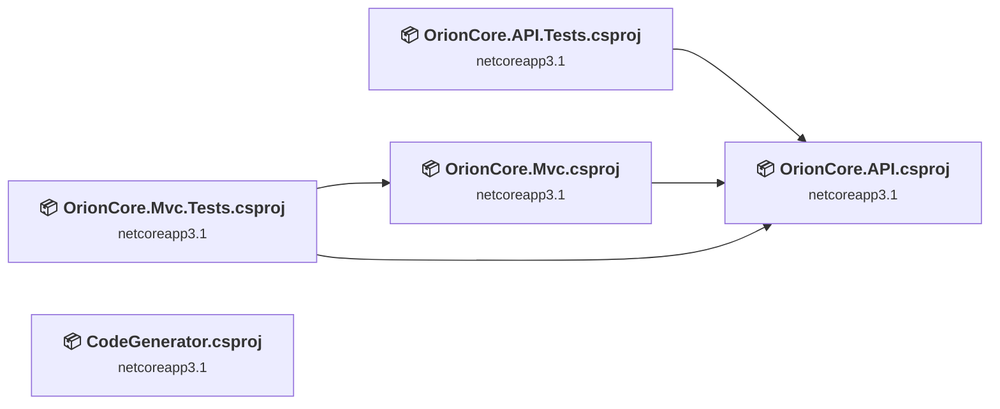
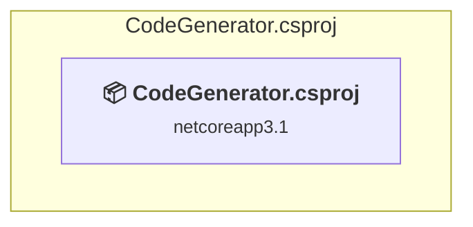
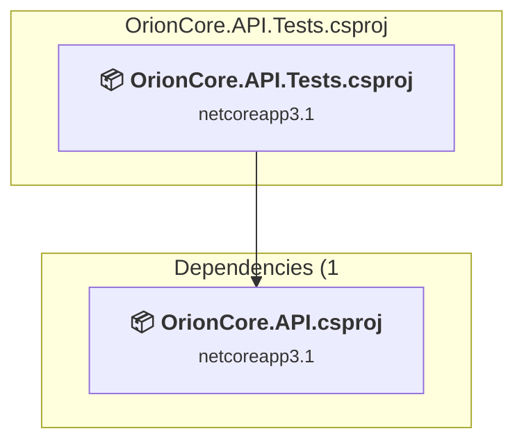
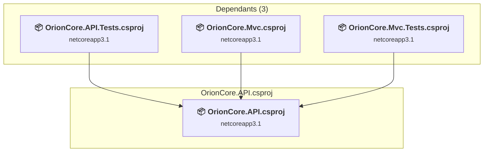
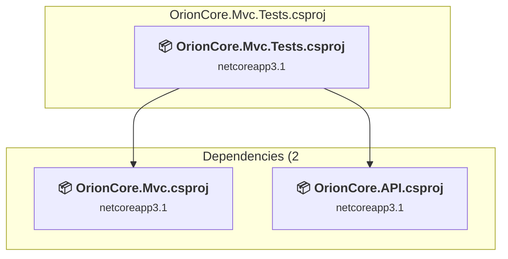
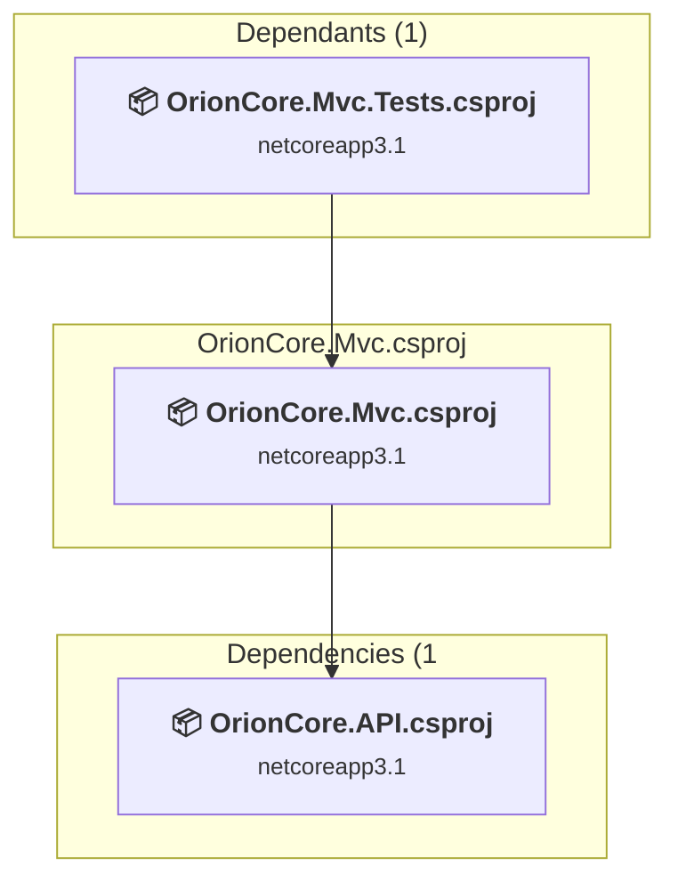

# Projects and dependencies analysis

This document provides a comprehensive overview of the projects and their dependencies in the context of upgrading to .NETCoreApp,Version=v8.0.

## Table of Contents

- [Executive Summary](#executive-Summary)
  - [Highlevel Metrics](#highlevel-metrics)
  - [Projects Compatibility](#projects-compatibility)
  - [Package Compatibility](#package-compatibility)
  - [API Compatibility](#api-compatibility)
- [Aggregate NuGet packages details](#aggregate-nuget-packages-details)
- [Top API Migration Challenges](#top-api-migration-challenges)
  - [Technologies and Features](#technologies-and-features)
  - [Most Frequent API Issues](#most-frequent-api-issues)
- [Projects Relationship Graph](#projects-relationship-graph)
- [Project Details](#project-details)

  - [CodeGenerator\CodeGenerator.csproj](#codegeneratorcodegeneratorcsproj)
  - [OrionCore.API.Tests\OrionCore.API.Tests.csproj](#orioncoreapitestsorioncoreapitestscsproj)
  - [OrionCore.API\OrionCore.API.csproj](#orioncoreapiorioncoreapicsproj)
  - [OrionCore.Mvc.Tests\OrionCore.Mvc.Tests.csproj](#orioncoremvctestsorioncoremvctestscsproj)
  - [OrionCore.Mvc\OrionCore.Mvc.csproj](#orioncoremvcorioncoremvccsproj)

## Executive Summary

### Highlevel Metrics

| Metric | Count | Status |
| :--- | :---: | :--- |
| Total Projects | 5 | All require upgrade |
| Total NuGet Packages | 15 | 8 need upgrade |
| Total Code Files | 162 |  |
| Total Code Files with Incidents | 14 |  |
| Total Lines of Code | 22009 |  |
| Total Number of Issues | 206 |  |
| Estimated LOC to modify | 188+ | at least 0.9% of codebase |

### Projects Compatibility

| Project | Target Framework | Difficulty | Package Issues | API Issues | Est. LOC Impact | Description |
| :--- | :---: | :---: | :---: | :---: | :---: | :--- |
| [CodeGenerator\CodeGenerator.csproj](#codegeneratorcodegeneratorcsproj) | netcoreapp3.1 | 🟡 Medium | 2 | 124 | 124+ | Wpf, Sdk Style = True |
| [OrionCore.API.Tests\OrionCore.API.Tests.csproj](#orioncoreapitestsorioncoreapitestscsproj) | netcoreapp3.1 | 🟢 Low | 6 | 0 |  | DotNetCoreApp, Sdk Style = True |
| [OrionCore.API\OrionCore.API.csproj](#orioncoreapiorioncoreapicsproj) | netcoreapp3.1 | 🟢 Low | 3 | 35 | 35+ | ClassLibrary, Sdk Style = True |
| [OrionCore.Mvc.Tests\OrionCore.Mvc.Tests.csproj](#orioncoremvctestsorioncoremvctestscsproj) | netcoreapp3.1 | 🟢 Low | 0 | 0 |  | DotNetCoreApp, Sdk Style = True |
| [OrionCore.Mvc\OrionCore.Mvc.csproj](#orioncoremvcorioncoremvccsproj) | netcoreapp3.1 | 🟢 Low | 2 | 29 | 29+ | AspNetCore, Sdk Style = True |

### Package Compatibility

| Status | Count | Percentage |
| :--- | :---: | :---: |
| ✅ Compatible | 7 | 46.7% |
| ⚠️ Incompatible | 0 | 0.0% |
| 🔄 Upgrade Recommended | 8 | 53.3% |
| ***Total NuGet Packages*** | ***15*** | ***100%*** |

### API Compatibility

| Category | Count | Impact |
| :--- | :---: | :--- |
| 🔴 Binary Incompatible | 105 | High - Require code changes |
| 🟡 Source Incompatible | 83 | Medium - Needs re-compilation and potential conflicting API error fixing |
| 🔵 Behavioral change | 0 | Low - Behavioral changes that may require testing at runtime |
| ✅ Compatible | 17527 |  |
| ***Total APIs Analyzed*** | ***17715*** |  |

## Aggregate NuGet packages details

| Package | Current Version | Suggested Version | Projects | Description |
| :--- | :---: | :---: | :--- | :--- |
| Autofac | 5.1.2 |  | [OrionCore.API.csproj](#orioncoreapiorioncoreapicsproj) | ✅Compatible |
| coverlet.collector | 1.2.0 |  | [OrionCore.API.Tests.csproj](#orioncoreapitestsorioncoreapitestscsproj) [OrionCore.Mvc.Tests.csproj](#orioncoremvctestsorioncoremvctestscsproj) | ✅Compatible |
| Microsoft.EntityFrameworkCore | 3.1.21 | 8.0.24 | [CodeGenerator.csproj](#codegeneratorcodegeneratorcsproj) [OrionCore.API.Tests.csproj](#orioncoreapitestsorioncoreapitestscsproj) | 建議升級 NuGet 套件 |
| Microsoft.EntityFrameworkCore.Design | 3.1.21 | 8.0.24 | [OrionCore.API.Tests.csproj](#orioncoreapitestsorioncoreapitestscsproj) | 建議升級 NuGet 套件 |
| Microsoft.EntityFrameworkCore.Relational | 3.1.21 | 8.0.24 | [CodeGenerator.csproj](#codegeneratorcodegeneratorcsproj) [OrionCore.API.Tests.csproj](#orioncoreapitestsorioncoreapitestscsproj) | 建議升級 NuGet 套件 |
| Microsoft.EntityFrameworkCore.Sqlite | 3.1.21 | 8.0.24 | [OrionCore.API.Tests.csproj](#orioncoreapitestsorioncoreapitestscsproj) | 建議升級 NuGet 套件 |
| Microsoft.EntityFrameworkCore.SqlServer | 3.1.21 | 8.0.24 | [OrionCore.API.Tests.csproj](#orioncoreapitestsorioncoreapitestscsproj) | 建議升級 NuGet 套件 |
| Microsoft.EntityFrameworkCore.Tools | 3.1.21 | 8.0.24 | [OrionCore.API.Tests.csproj](#orioncoreapitestsorioncoreapitestscsproj) | 建議升級 NuGet 套件 |
| Microsoft.NET.Test.Sdk | 16.5.0 |  | [OrionCore.API.Tests.csproj](#orioncoreapitestsorioncoreapitestscsproj) [OrionCore.Mvc.Tests.csproj](#orioncoremvctestsorioncoremvctestscsproj) | ✅Compatible |
| Newtonsoft.Json | 13.0.1 | 13.0.4 | [OrionCore.API.csproj](#orioncoreapiorioncoreapicsproj) | 建議升級 NuGet 套件 |
| NLog | 4.7.12 |  | [OrionCore.API.csproj](#orioncoreapiorioncoreapicsproj) | ✅Compatible |
| Npgsql.EntityFrameworkCore.PostgreSQL | 3.1.2 |  | [OrionCore.API.Tests.csproj](#orioncoreapitestsorioncoreapitestscsproj) | ✅Compatible |
| System.Drawing.Common | 4.7.0 | 8.0.24 | [OrionCore.API.csproj](#orioncoreapiorioncoreapicsproj) [OrionCore.Mvc.csproj](#orioncoremvcorioncoremvccsproj) | 建議升級 NuGet 套件 |
| xunit | 2.4.1 |  | [OrionCore.API.Tests.csproj](#orioncoreapitestsorioncoreapitestscsproj) [OrionCore.Mvc.Tests.csproj](#orioncoremvctestsorioncoremvctestscsproj) | ✅Compatible |
| xunit.runner.visualstudio | 2.4.3 |  | [OrionCore.API.Tests.csproj](#orioncoreapitestsorioncoreapitestscsproj) [OrionCore.Mvc.Tests.csproj](#orioncoremvctestsorioncoremvctestscsproj) | ✅Compatible |

## Top API Migration Challenges

### Technologies and Features

| Technology | Issues | Percentage | Migration Path |
| :--- | :---: | :---: | :--- |
| GDI+ / System.Drawing | 61 | 32.4% | System.Drawing APIs for 2D graphics, imaging, and printing that are available via NuGet package System.Drawing.Common. Note: Not recommended for server scenarios due to Windows dependencies; consider cross-platform alternatives like SkiaSharp or ImageSharp for new code. |
| WPF (Windows Presentation Foundation) | 26 | 13.8% | WPF APIs for building Windows desktop applications with XAML-based UI that are available in .NET on Windows. WPF provides rich desktop UI capabilities with data binding and styling. Enable Windows Desktop support: Option 1 (Recommended): Target net9.0-windows; Option 2: Add <UseWindowsDesktop>true</UseWindowsDesktop>. |
| Legacy Configuration System | 19 | 10.1% | Legacy XML-based configuration system (app.config/web.config) that has been replaced by a more flexible configuration model in .NET Core. The old system was rigid and XML-based. Migrate to Microsoft.Extensions.Configuration with JSON/environment variables; use System.Configuration.ConfigurationManager NuGet package as interim bridge if needed. |
| Legacy Cryptography | 1 | 0.5% | Obsolete or insecure cryptographic algorithms that have been deprecated for security reasons. These algorithms are no longer considered secure by modern standards. Migrate to modern cryptographic APIs using secure algorithms. |

### Most Frequent API Issues

| API | Count | Percentage | Category |
| :--- | :---: | :---: | :--- |
| P:System.Configuration.ApplicationSettingsBase.Item(System.String) | 16 | 8.5% | Source Incompatible |
| T:System.Windows.RoutedEventHandler | 12 | 6.4% | Binary Incompatible |
| T:System.Drawing.Imaging.ImageFormat | 7 | 3.7% | Source Incompatible |
| T:System.Drawing.FontFamily | 7 | 3.7% | Source Incompatible |
| T:System.Windows.MessageBoxImage | 6 | 3.2% | Binary Incompatible |
| T:System.Windows.MessageBoxButton | 6 | 3.2% | Binary Incompatible |
| T:System.Windows.Controls.TextBox | 6 | 3.2% | Binary Incompatible |
| E:System.Windows.Controls.Primitives.ButtonBase.Click | 5 | 2.7% | Binary Incompatible |
| T:System.Windows.Threading.DispatcherUnhandledExceptionEventHandler | 4 | 2.1% | Binary Incompatible |
| P:Microsoft.Win32.FileDialog.FileName | 4 | 2.1% | Binary Incompatible |
| T:System.Drawing.Printing.PrintDocument | 4 | 2.1% | Source Incompatible |
| T:System.Drawing.Bitmap | 4 | 2.1% | Source Incompatible |
| T:System.Drawing.Graphics | 4 | 2.1% | Source Incompatible |
| F:System.Windows.MessageBoxImage.Error | 3 | 1.6% | Binary Incompatible |
| F:System.Windows.MessageBoxButton.OK | 3 | 1.6% | Binary Incompatible |
| T:System.Windows.MessageBox | 3 | 1.6% | Binary Incompatible |
| T:System.Windows.MessageBoxResult | 3 | 1.6% | Binary Incompatible |
| M:System.Windows.MessageBox.Show(System.String,System.String,System.Windows.MessageBoxButton,System.Windows.MessageBoxImage) | 3 | 1.6% | Binary Incompatible |
| T:System.Windows.RoutedEventArgs | 3 | 1.6% | Binary Incompatible |
| T:System.Windows.ExitEventHandler | 2 | 1.1% | Binary Incompatible |
| E:System.Windows.Application.DispatcherUnhandledException | 2 | 1.1% | Binary Incompatible |
| M:System.Windows.Application.#ctor | 2 | 1.1% | Binary Incompatible |
| T:System.Windows.Application | 2 | 1.1% | Binary Incompatible |
| T:System.Windows.Controls.SelectionChangedEventHandler | 2 | 1.1% | Binary Incompatible |
| M:Microsoft.Win32.CommonDialog.ShowDialog | 2 | 1.1% | Binary Incompatible |
| P:Microsoft.Win32.FileDialog.RestoreDirectory | 2 | 1.1% | Binary Incompatible |
| P:Microsoft.Win32.FileDialog.Filter | 2 | 1.1% | Binary Incompatible |
| P:Microsoft.Win32.FileDialog.Title | 2 | 1.1% | Binary Incompatible |
| T:Microsoft.Win32.OpenFileDialog | 2 | 1.1% | Binary Incompatible |
| M:Microsoft.Win32.OpenFileDialog.#ctor | 2 | 1.1% | Binary Incompatible |
| M:System.Windows.Controls.Primitives.TextBoxBase.AppendText(System.String) | 2 | 1.1% | Binary Incompatible |
| P:System.Windows.FrameworkElement.DataContext | 2 | 1.1% | Binary Incompatible |
| M:System.Windows.Window.#ctor | 2 | 1.1% | Binary Incompatible |
| P:System.Drawing.Imaging.ImageFormat.Png | 2 | 1.1% | Source Incompatible |
| M:System.Drawing.Image.Save(System.IO.Stream,System.Drawing.Imaging.ImageFormat) | 2 | 1.1% | Source Incompatible |
| P:System.Drawing.Printing.PageSettings.Bounds | 2 | 1.1% | Source Incompatible |
| M:System.Drawing.Graphics.Clear(System.Drawing.Color) | 2 | 1.1% | Source Incompatible |
| M:System.Drawing.Graphics.FromImage(System.Drawing.Image) | 2 | 1.1% | Source Incompatible |
| T:System.Drawing.Printing.PaperSize | 2 | 1.1% | Source Incompatible |
| P:System.Drawing.Printing.PageSettings.PaperSize | 2 | 1.1% | Source Incompatible |
| M:System.Drawing.Bitmap.#ctor(System.Int32,System.Int32) | 2 | 1.1% | Source Incompatible |
| M:System.Exception.#ctor(System.Runtime.Serialization.SerializationInfo,System.Runtime.Serialization.StreamingContext) | 2 | 1.1% | Source Incompatible |
| T:System.Drawing.FontStyle | 2 | 1.1% | Source Incompatible |
| M:System.Configuration.ApplicationSettingsBase.#ctor | 1 | 0.5% | Source Incompatible |
| T:System.Configuration.ApplicationSettingsBase | 1 | 0.5% | Source Incompatible |
| M:System.Windows.Application.Run | 1 | 0.5% | Binary Incompatible |
| P:System.Windows.Application.StartupUri | 1 | 0.5% | Binary Incompatible |
| E:System.Windows.Application.Exit | 1 | 0.5% | Binary Incompatible |
| T:System.Windows.ExitEventArgs | 1 | 0.5% | Binary Incompatible |
| M:System.Configuration.ApplicationSettingsBase.Save | 1 | 0.5% | Source Incompatible |

## Projects Relationship Graph

Legend:
📦 SDK-style project
⚙️ Classic project

## Project Details

### CodeGenerator\CodeGenerator.csproj

#### Project Info

- **Current Target Framework:** netcoreapp3.1
- **Proposed Target Framework:** net8.0-windows
- **SDK-style**: True
- **Project Kind:** Wpf
- **Dependencies**: 0
- **Dependants**: 0
- **Number of Files**: 24
- **Number of Files with Incidents**: 6
- **Lines of Code**: 4433
- **Estimated LOC to modify**: 124+ (at least 2.8% of the project)

#### Dependency Graph

Legend:
📦 SDK-style project
⚙️ Classic project

### API Compatibility

| Category | Count | Impact |
| :--- | :---: | :--- |
| 🔴 Binary Incompatible | 105 | High - Require code changes |
| 🟡 Source Incompatible | 19 | Medium - Needs re-compilation and potential conflicting API error fixing |
| 🔵 Behavioral change | 0 | Low - Behavioral changes that may require testing at runtime |
| ✅ Compatible | 2487 |  |
| ***Total APIs Analyzed*** | ***2611*** |  |

#### Project Technologies and Features

| Technology | Issues | Percentage | Migration Path |
| :--- | :---: | :---: | :--- |
| Legacy Configuration System | 19 | 15.3% | Legacy XML-based configuration system (app.config/web.config) that has been replaced by a more flexible configuration model in .NET Core. The old system was rigid and XML-based. Migrate to Microsoft.Extensions.Configuration with JSON/environment variables; use System.Configuration.ConfigurationManager NuGet package as interim bridge if needed. |
| WPF (Windows Presentation Foundation) | 26 | 21.0% | WPF APIs for building Windows desktop applications with XAML-based UI that are available in .NET on Windows. WPF provides rich desktop UI capabilities with data binding and styling. Enable Windows Desktop support: Option 1 (Recommended): Target net9.0-windows; Option 2: Add <UseWindowsDesktop>true</UseWindowsDesktop>. |

### OrionCore.API.Tests\OrionCore.API.Tests.csproj

#### Project Info

- **Current Target Framework:** netcoreapp3.1
- **Proposed Target Framework:** net8.0
- **SDK-style**: True
- **Project Kind:** DotNetCoreApp
- **Dependencies**: 1
- **Dependants**: 0
- **Number of Files**: 26
- **Number of Files with Incidents**: 1
- **Lines of Code**: 2952
- **Estimated LOC to modify**: 0+ (at least 0.0% of the project)

#### Dependency Graph

Legend:
📦 SDK-style project
⚙️ Classic project

### API Compatibility

| Category | Count | Impact |
| :--- | :---: | :--- |
| 🔴 Binary Incompatible | 0 | High - Require code changes |
| 🟡 Source Incompatible | 0 | Medium - Needs re-compilation and potential conflicting API error fixing |
| 🔵 Behavioral change | 0 | Low - Behavioral changes that may require testing at runtime |
| ✅ Compatible | 2355 |  |
| ***Total APIs Analyzed*** | ***2355*** |  |

### OrionCore.API\OrionCore.API.csproj

#### Project Info

- **Current Target Framework:** netcoreapp3.1
- **Proposed Target Framework:** net8.0
- **SDK-style**: True
- **Project Kind:** ClassLibrary
- **Dependencies**: 0
- **Dependants**: 3
- **Number of Files**: 61
- **Number of Files with Incidents**: 4
- **Lines of Code**: 7969
- **Estimated LOC to modify**: 35+ (at least 0.4% of the project)

#### Dependency Graph

Legend:
📦 SDK-style project
⚙️ Classic project

### API Compatibility

| Category | Count | Impact |
| :--- | :---: | :--- |
| 🔴 Binary Incompatible | 0 | High - Require code changes |
| 🟡 Source Incompatible | 35 | Medium - Needs re-compilation and potential conflicting API error fixing |
| 🔵 Behavioral change | 0 | Low - Behavioral changes that may require testing at runtime |
| ✅ Compatible | 6352 |  |
| ***Total APIs Analyzed*** | ***6387*** |  |

#### Project Technologies and Features

| Technology | Issues | Percentage | Migration Path |
| :--- | :---: | :---: | :--- |
| GDI+ / System.Drawing | 32 | 91.4% | System.Drawing APIs for 2D graphics, imaging, and printing that are available via NuGet package System.Drawing.Common. Note: Not recommended for server scenarios due to Windows dependencies; consider cross-platform alternatives like SkiaSharp or ImageSharp for new code. |
| Legacy Cryptography | 1 | 2.9% | Obsolete or insecure cryptographic algorithms that have been deprecated for security reasons. These algorithms are no longer considered secure by modern standards. Migrate to modern cryptographic APIs using secure algorithms. |

### OrionCore.Mvc.Tests\OrionCore.Mvc.Tests.csproj

#### Project Info

- **Current Target Framework:** netcoreapp3.1
- **Proposed Target Framework:** net8.0
- **SDK-style**: True
- **Project Kind:** DotNetCoreApp
- **Dependencies**: 2
- **Dependants**: 0
- **Number of Files**: 6
- **Number of Files with Incidents**: 1
- **Lines of Code**: 215
- **Estimated LOC to modify**: 0+ (at least 0.0% of the project)

#### Dependency Graph

Legend:
📦 SDK-style project
⚙️ Classic project

### API Compatibility

| Category | Count | Impact |
| :--- | :---: | :--- |
| 🔴 Binary Incompatible | 0 | High - Require code changes |
| 🟡 Source Incompatible | 0 | Medium - Needs re-compilation and potential conflicting API error fixing |
| 🔵 Behavioral change | 0 | Low - Behavioral changes that may require testing at runtime |
| ✅ Compatible | 105 |  |
| ***Total APIs Analyzed*** | ***105*** |  |

### OrionCore.Mvc\OrionCore.Mvc.csproj

#### Project Info

- **Current Target Framework:** netcoreapp3.1
- **Proposed Target Framework:** net8.0
- **SDK-style**: True
- **Project Kind:** AspNetCore
- **Dependencies**: 1
- **Dependants**: 1
- **Number of Files**: 51
- **Number of Files with Incidents**: 2
- **Lines of Code**: 6440
- **Estimated LOC to modify**: 29+ (at least 0.5% of the project)

#### Dependency Graph

Legend:
📦 SDK-style project
⚙️ Classic project

### API Compatibility

| Category | Count | Impact |
| :--- | :---: | :--- |
| 🔴 Binary Incompatible | 0 | High - Require code changes |
| 🟡 Source Incompatible | 29 | Medium - Needs re-compilation and potential conflicting API error fixing |
| 🔵 Behavioral change | 0 | Low - Behavioral changes that may require testing at runtime |
| ✅ Compatible | 6228 |  |
| ***Total APIs Analyzed*** | ***6257*** |  |

#### Project Technologies and Features

| Technology | Issues | Percentage | Migration Path |
| :--- | :---: | :---: | :--- |
| GDI+ / System.Drawing | 29 | 100.0% | System.Drawing APIs for 2D graphics, imaging, and printing that are available via NuGet package System.Drawing.Common. Note: Not recommended for server scenarios due to Windows dependencies; consider cross-platform alternatives like SkiaSharp or ImageSharp for new code. |

